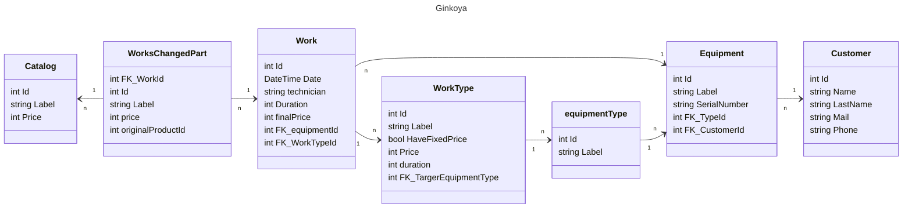

# Ginkoya_MaintenanceManager

Dans l’atelier dans un magasin, 3 techniciens ont besoin de tracer leurs travaux réalisés. 

L’hiver le magasin gère des skis, l’été le magasin gère des vélos.

Les travaux pour les skis sont : 
    Affutage et fartage, facturé 20€ et réalisé généralement en 15 minutes.
    Réparation, selon le temps passé et les pièces à changer : fixation complète, semelle 

Les travaux pour les vélos sont : 
    Révision annuelle, facturée 50€ et réalisée en 45 minutes.
    Réparation, selon le temps passé 1€ par minute et les pièces à changer : roue, pneu, câble de frein

Le client est identifié par un nom, prénom, mail et téléphone. 

Le vélo et skis sont identifié par un numéro série.

Une application va leur être réalisée pour les accompagner dans leur quotidien. 

## Concept

### ASP Net core blazor

## Model 

